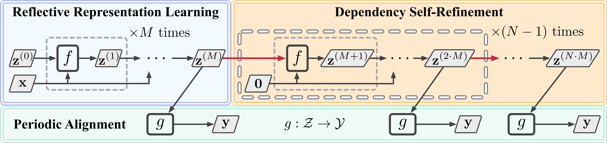
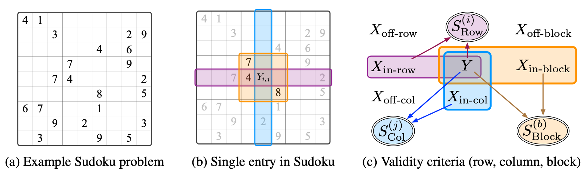

# SR2: Selection, Reflection and Self-Refinement

<p align="center">
  
</p>

<p align="center">
  <a href="https://arxiv.org/abs/2510.08222">
    
  </a>
  
  
  
</p>


## 📘 Overview

This repository provides the official implementation of the paper:

> **Selection, Reflection and Self-Refinement: Revisit Reasoning Tasks via a Causal Lens**  
> [https://arxiv.org/abs/2510.08222](https://arxiv.org/abs/2510.08222)

We introduce a framework called **SR²** that incorporates estimated latent variables as feedback into a selection mechanism, enabling the learning of dense dependencies among latent representations. The framework is composed of three key modules below.

1. **Reflective Representation Learning**: Learns latent variables that capture structured reasoning signals.
2. **Dependency Self-Refinement**: Iteratively refines latent dependencies using the selection feedback.
3. **Periodic Intermediate Alignment**: Aligns intermediate representations with causal structure to stabilize training.

Experimentally, SR² delivers substantial gains in reasoning accuracy. For example, on Sudoku and Maze tasks, SR² achieves **over 10% improvement** in performance while using **8× fewer parameters** compared with recent strong baselines.

> [!NOTE]  
> This project is built on top of the **HRM** repository ([sapientinc/HRM](https://github.com/sapientinc/HRM)). We reuse its attention layer designs, optimizer, embeddings, and most of the hyperparameters, while **replacing the model architecture and training procedure** with the SR² framework.


## 🧩 Reasoning Task Illustration

<p align="center">
  
</p>

**Illustration of reasoning tasks and the selection mechanism using Sudoku as an example.**

- (a) A sample $9 \times 9$ Sudoku puzzle with a subset of given clues; the goal is to fill the remaining cells so that each row, column, and $3 \times 3$ subgrid contains the digits $1$–$9$ exactly once.  
- (b) A single unfilled cell $Y_{ij}$ with its row (purple), column (blue), and $3 \times 3$ block (orange) highlighted. The digits within these groups impose constraints that determine the admissible values for $Y_{ij}$.  
- (c) **Selection mechanism**: a candidate value $Y$ is valid if and only if the validity criteria are satisfied:  
$S^i_{Row} = S^j_{Col} = S^b_{Block} = 1$


## 🛠️ Environment Setup

Our main experiments were conducted on:

- **Sudoku / Maze**: 8 × AMD MI210 (ROCm 6.2)  
- **ARC-1 / ARC-2**: 8 × NVIDIA H200 NVL (CUDA 12.8)

> [!IMPORTANT]  
> For reproducing **ARC-1** and **ARC-2** experiments, we strongly recommend:
> - **CUDA ≥ 12.8**
> - NVIDIA **Hopper**-class GPUs  
> to take full advantage of **FlashAttention-3** for efficient training.

Below we assume that **CUDA 12.8** is properly installed and configured.

### 🔹 1. Clone the repository

```bash
git clone https://github.com/dengyl20/SR2.git
cd SR2
````

### 🔹 2. Create a new virtual environment

```bash
conda create -n sr2 python==3.12
conda activate sr2
```

### 🔹 3. Install PyTorch (recommended: 2.5.0 or later)

```bash
pip install torch==2.7.0 torchvision==0.22.0 torchaudio==2.7.0 \
  --index-url https://download.pytorch.org/whl/cu128
```

> [!NOTE]
> Adjust the PyTorch version and index URL if your CUDA setup differs. The above command assumes **CUDA 12.8 wheels** are available from the official PyTorch index.

### 🔹 4. Install additional dependencies

```bash
pip install -r requirements.txt
```

### 🔹 5. (Optional) Install FlashAttention-3 and adam-atan2

These components are optional but strongly recommended for faster and more stable training.

```bash
# adam-atan2
pip install packaging ninja wheel setuptools setuptools-scm
pip install --no-cache-dir --no-build-isolation adam-atan2

# Flash Attention 3
git clone git@github.com:Dao-AILab/flash-attention.git
cd flash-attention/hopper
python setup.py install
```

> [!TIP]
> If you are using ROCm or a non-Hopper GPU, you may need to skip FlashAttention-3 or use a backend compatible with your hardware.

## 🚀 Quick Start

After the environment is configured, you can quickly reproduce the **Sudoku** and **Maze** results from the paper.

> [!NOTE]
> For **ARC-1** and **ARC-2**, please refer to
> **[arc-agi/README.md](./arc-agi/README.md)**
> for dedicated instructions and configuration details.

### 🔹 1. Build datasets

We directly reuse the data processing scripts and original data from the HRM repository.

```bash
# Initialize submodules 
git submodule update --init --recursive

# Sudoku-Extreme (1000 examples with augmentation)
python dataset/build_sudoku_dataset.py \
  --output-dir data/sudoku-extreme-1k-aug-1000 \
  --subsample-size 1000 \
  --num-aug 1000

# Maze (1000 examples)
python dataset/build_maze_dataset.py
```

> [!IMPORTANT]
> Ensure all submodules have been initialized successfully. Missing raw data or scripts will cause dataset preparation to fail.

### 🔹 2. Configure Weights & Biases (W&B)

We use **Weights & Biases (wandb.ai)** to log training curves, evaluation metrics, and experiment configurations.

Edit `config/cfg_pretrain.yaml` and replace the placeholder:

```yaml
wandb_key: <your_wandb_key>
```

with your actual W&B API key.

> [!TIP]
> You can obtain your W&B key from your user settings page on [https://wandb.ai](https://wandb.ai). Make sure you are logged in when launching experiments.

### 🔹 3. Run experiments

```bash
# Train on Sudoku-Extreme
bash pretrain_sudoku.sh

# Train on Maze-Hard
bash pretrain_maze.sh
```

These scripts will:

* Load the the model architecture.
* Prepare the corresponding dataset splits.
* Launch training and periodic evaluation.
* Log all metrics (e.g., `all.exact_accuracy`) to W&B.

> [!NOTE]
> Hyperparameters largely follow HRM settings. Only changes relevant to the SR² framework (architecture and training dynamics) are introduced.

## 📊 Evaluation

1. **Training curves and evaluation metrics**

   * All training metrics and evaluation metrics (`all.exact_accuracy`), can be found in the corresponding W&B runs.
   * Use W&B dashboards to inspect convergence, stability, and performance across tasks.

2. **Reporting metrics**

   * For **SR²** and **all baselines** reported in the paper, we **select the peak value** of the evaluation curve (best `all.exact_accuracy`) rather than the last evaluation point.
   * This follows the evaluation protocol used in the paper to fairly compare model capacities.

3. **Reproducibility**

   * We provide W&B reports and model checkpoints as reference.
   * Under comparable environment settings (hardware, CUDA/ROCm, and software versions), repeated runs should exhibit variation within approximately **1%** absolute accuracy.

> [!CAUTION]
> Differences in GPU architecture, CUDA/ROCm versions, or third-party library implementations (e.g., FlashAttention versions) may introduce minor deviations in the final metrics.

## 🙏 Acknowledgements

We gratefully acknowledge:

* The **HRM** project: [https://github.com/sapientinc/HRM](https://github.com/sapientinc/HRM)
* The **ARC-Prize** team and their **hierarchical-reasoning-model-analysis** project:
  [https://github.com/arcprize/hierarchical-reasoning-model-analysis](https://github.com/arcprize/hierarchical-reasoning-model-analysis)

Our project framework is built on top of these two excellent codebases.

## 📚 Citation

If you find this repository useful in your research, please consider citing:

```bibtex
@misc{deng2025selectionreflectionselfrefinementrevisit,
      title         = {Selection, Reflection and Self-Refinement: Revisit Reasoning Tasks via a Causal Lens},
      author        = {Yunlong Deng and Boyang Sun and Yan Li and Lingjing Kong and Zeyu Tang and Kun Zhang and Guangyi Chen},
      year          = {2025},
      eprint        = {2510.08222},
      archivePrefix = {arXiv},
      primaryClass  = {cs.AI},
      url           = {https://arxiv.org/abs/2510.08222}
}
```


